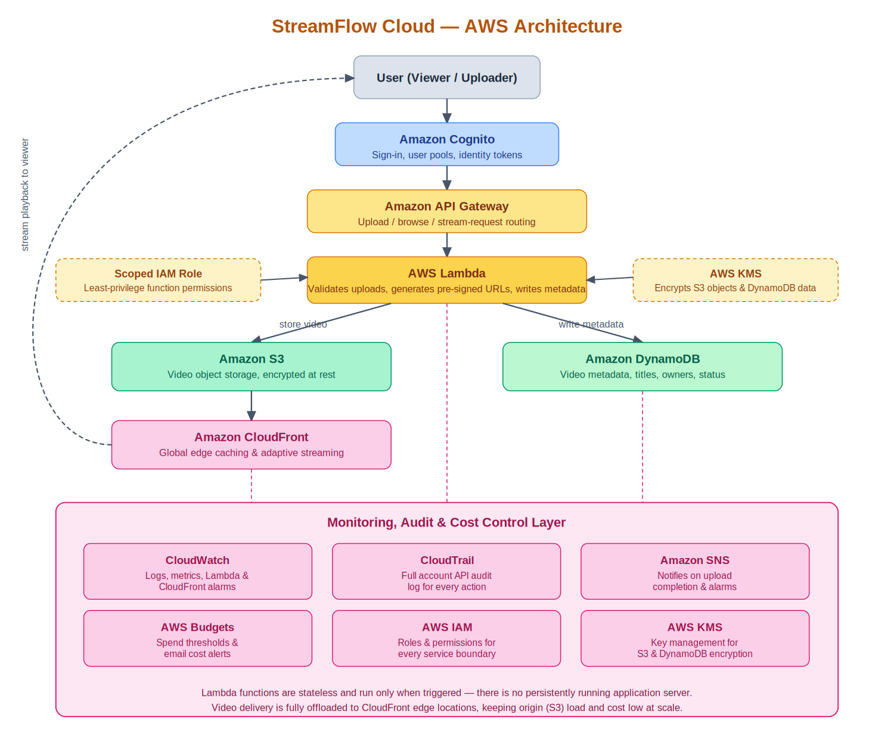

# StreamFlow Cloud

A scalable, serverless media streaming platform on AWS — Cloud Computing capstone project.

Users sign in, upload a video, and stream it back through a global CDN, with no
persistently running server anywhere in the stack. Built to stay inside AWS
Free Tier limits.

📄 Full proposal: [`docs/StreamFlow_Cloud_Proposal.docx`](docs/StreamFlow_Cloud_Proposal.docx)

## Architecture



```
User → Cognito (auth) → API Gateway → Lambda → S3 (video) + DynamoDB (metadata)
                                                     │
                                                     ▼
                                              CloudFront (edge streaming)
                                                     │
                                        CloudWatch · CloudTrail · SNS · Budgets
```

## Status

| Phase | What it builds | Status |
|---|---|---|
| 1 — Foundation | Cognito user pool, S3 video bucket, DynamoDB table, IAM role, SNS topic | ✅ Deployed |
| 2 — CloudFront | CDN distribution with Origin Access Control, locked-down bucket policy | ⏳ Blocked on AWS account verification (Support case `179033330600351`) |
| 3 — Compute | Lambda functions (upload validation, metadata write) + API Gateway routes | ✅ Built, not yet deployed |
| 4 — Monitoring | CloudWatch alarms, CloudTrail, Budgets alerts | 🔜 Planned |

## Repo layout

```
streamflow-cloud/
├── infra/
│   └── cloudformation/
│       ├── 01-foundation.yaml    # Cognito, S3, DynamoDB, IAM, SNS
│       ├── 02-cloudfront.yaml    # CloudFront distribution + bucket policy
│       └── 03-compute-api.yaml   # Lambda functions + HTTP API + Cognito authorizer
├── lambda/
│   ├── generate_presigned_url/   # API-triggered: issues pre-signed S3 upload URLs
│   ├── process_upload/           # S3-triggered: validates uploads, updates metadata
│   └── custom_resource_s3_notify/# CFN custom resource: wires S3 -> Lambda notification
├── docs/
│   ├── StreamFlow_Cloud_Proposal.docx
│   └── architecture.png
└── .github/workflows/           # CI (added when Phase 4 lands)
```

## Prerequisites

- An AWS account with the CLI configured (`aws configure`)
- AWS CLI v2
- Region: `us-east-1` (used throughout the templates/commands below)

## Deploying

Deploy the stacks in order — Phase 2 imports outputs from Phase 1.

```bash
# Phase 1 — Foundation
aws cloudformation deploy \
  --template-file infra/cloudformation/01-foundation.yaml \
  --stack-name streamflow-dev-foundation \
  --capabilities CAPABILITY_NAMED_IAM \
  --region us-east-1

# Phase 2 — CloudFront
aws cloudformation deploy \
  --template-file infra/cloudformation/02-cloudfront.yaml \
  --stack-name streamflow-dev-cloudfront \
  --region us-east-1

# Check outputs (bucket name, table name, CloudFront domain, etc.)
aws cloudformation describe-stacks \
  --stack-name streamflow-dev-foundation \
  --query "Stacks[0].Outputs" --region us-east-1

aws cloudformation describe-stacks \
  --stack-name streamflow-dev-cloudfront \
  --query "Stacks[0].Outputs" --region us-east-1
```

CloudFront distributions take 10–15 minutes to fully deploy on first creation.

**One manual step:** in the CloudFront console, switch the distribution's
pricing plan from Pay-as-you-go to the **Free** flat-rate plan (not yet
settable via CloudFormation).

### Phase 3 — Compute (Lambda + API Gateway)

Phase 3's Lambda functions are real Python files (not tiny inline snippets),
so `03-compute-api.yaml` references them by local path — that only resolves
through `aws cloudformation package`, which zips each function's folder and
uploads it to an S3 artifacts bucket for you.

```bash
# One-time: create a bucket to hold packaged Lambda artifacts
ACCOUNT_ID=$(aws sts get-caller-identity --query Account --output text)
aws s3 mb "s3://streamflow-dev-lambda-artifacts-${ACCOUNT_ID}" --region us-east-1

# Package: rewrites local Code: paths into S3Bucket/S3Key references
aws cloudformation package \
  --template-file infra/cloudformation/03-compute-api.yaml \
  --s3-bucket "streamflow-dev-lambda-artifacts-${ACCOUNT_ID}" \
  --output-template-file infra/cloudformation/03-compute-api.packaged.yaml

# Deploy the packaged template (not the original file)
aws cloudformation deploy \
  --template-file infra/cloudformation/03-compute-api.packaged.yaml \
  --stack-name streamflow-dev-compute \
  --capabilities CAPABILITY_NAMED_IAM \
  --region us-east-1

# Get the API endpoint
aws cloudformation describe-stacks \
  --stack-name streamflow-dev-compute \
  --query "Stacks[0].Outputs" --region us-east-1
```

Phase 3 depends only on Phase 1's exports (not Phase 2), so it can be
deployed while CloudFront is still waiting on AWS Support.

**Note:** `01-foundation.yaml` gained a new output
(`VideoMetadataTableArn`) that Phase 3 needs. Since Phase 1 is already
deployed, re-run its `deploy` command once more before deploying Phase 3 —
CloudFormation will apply it as a safe, in-place update (adding an output
never touches existing resources).

**Testing the upload-URL endpoint** once deployed — you need a real Cognito
ID token. Quickest way for a demo account:

```bash
# Create a test user (one-time)
aws cognito-idp admin-create-user \
  --user-pool-id <UserPoolId from Phase 1 outputs> \
  --username demo@example.com \
  --temporary-password 'TempPass123!' \
  --message-action SUPPRESS --region us-east-1

aws cognito-idp admin-set-user-password \
  --user-pool-id <UserPoolId> \
  --username demo@example.com \
  --password 'RealPass123!' --permanent --region us-east-1

# Get an ID token
aws cognito-idp initiate-auth \
  --auth-flow USER_PASSWORD_AUTH \
  --client-id <UserPoolClientId from Phase 1 outputs> \
  --auth-parameters USERNAME=demo@example.com,PASSWORD='RealPass123!' \
  --region us-east-1
# copy the "IdToken" value from the response

# Call the API
curl -X POST "<ApiEndpoint from Phase 3 outputs>/videos/upload-url" \
  -H "Authorization: Bearer <IdToken>" \
  -H "Content-Type: application/json" \
  -d '{"title": "Test video", "contentType": "video/mp4"}'

# Response includes an uploadUrl - PUT a real file to it to trigger
# process_upload automatically:
curl -X PUT "<uploadUrl from the response above>" \
  -H "Content-Type: video/mp4" \
  --data-binary @/path/to/a/small/test.mp4
```

## Tearing down

Delete in reverse order, since later stacks depend on Phase 1's exports:

```bash
aws cloudformation delete-stack --stack-name streamflow-dev-compute --region us-east-1
aws cloudformation wait stack-delete-complete --stack-name streamflow-dev-compute --region us-east-1

aws cloudformation delete-stack --stack-name streamflow-dev-cloudfront --region us-east-1
aws cloudformation wait stack-delete-complete --stack-name streamflow-dev-cloudfront --region us-east-1

aws cloudformation delete-stack --stack-name streamflow-dev-foundation --region us-east-1
```

Note: S3 buckets with objects in them won't delete via CloudFormation until
emptied first (`aws s3 rm s3://<bucket-name> --recursive`). This applies to
the video bucket, the CloudFront logs bucket, and the Lambda artifacts
bucket created for `aws cloudformation package` (which isn't managed by any
stack, so delete it manually too:
`aws s3 rb s3://streamflow-dev-lambda-artifacts-<account-id> --force`).

## Cost notes

Designed to run inside AWS Free Tier. See the "Estimated Cost / Free Tier
Usage" section of the proposal for details. The main things to watch:
CloudFront data transfer past its free allowance, and a customer-managed KMS
key if one is added later (~$1/month) — both AWS-managed default encryption
keys are used for now, which carry no extra charge.

## License

This is a student capstone project; no license is asserted.
